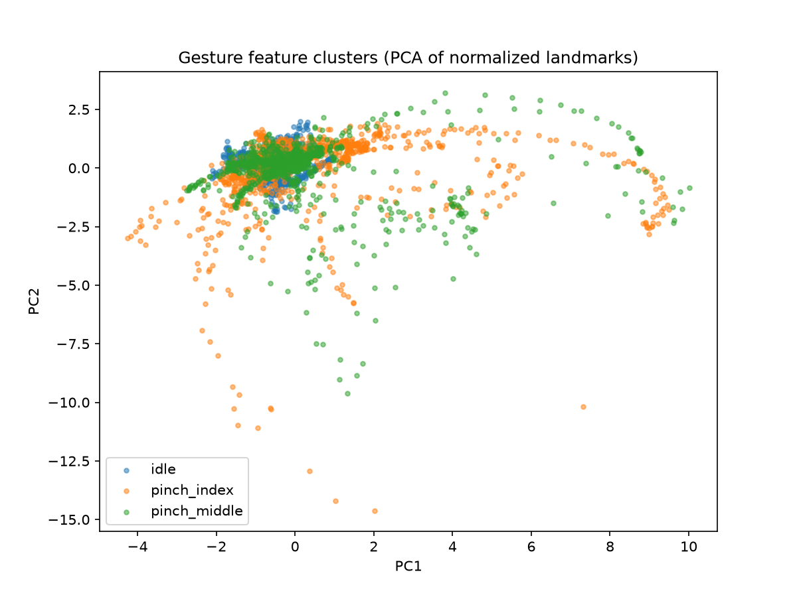

# Gesture Control App — macOS Hand Gesture Volume & Brightness Control

A background macOS tool that uses webcam-based hand-landmark tracking (MediaPipe) and a small trained classifier to control system volume and brightness through pinch-and-drag gestures. Self-directed portfolio project, not tied to a specific job-posting skill gap.

## Status

| Phase | Scope | Status |
|---|---|---|
| 1 | Core loop: camera → landmarks → geometric pinch detection → system actions | Done |
| 2 | Trained MLP classifier on self-recorded data, normalization, idle class, majority-vote smoothing | Done |
| 3 | Expanded gesture set (media, Mission Control, kill-switch, cursor), engagement-zone design | Next |
| 4 | Menu-bar app packaging, permissions UX | Planned |

## Project structure

```
gesture-control/
├── main.py                 # The application: camera loop + classifier + smoothing + actions
├── gesture_detector.py     # normalize_landmarks(), GestureSmoother, get_drag_displacement(),
│                           # plus the Phase 1 geometric detectors (is_pinching, is_pinching_middle)
│                           # kept as the baseline the classifier replaced
├── actions.py              # System-level volume/brightness read + write (osascript, brightness CLI)
├── collect_data.py         # Records labeled landmark frames to gesture_data.csv
├── check_data.py           # Verifies row shape and class balance of the recorded data
├── test_normalize.py       # Live check that normalization is position- and distance-invariant
├── train_classifier.py     # Trains and evaluates the MLP, saves gesture_classifier.pkl
├── pca_plot.py             # PCA cluster plot of the normalized features
├── hand_tracking_test.py   # Standalone diagnostic: camera + landmark overlay only. Kept to isolate
│                           # the camera/MediaPipe pipeline from gesture logic when debugging.
├── gesture_data.csv        # Recorded training data (3,713 frames, 3 classes)
├── gesture_classifier.pkl  # Trained model loaded by main.py
├── pca_clusters.png
├── .gitignore
└── README.md
```

## Setup

Requires Python 3.9–3.12 (MediaPipe does not yet support 3.13+).

```bash
brew install python@3.11
python3.11 -m venv venv
source venv/bin/activate
pip install opencv-python mediapipe==0.10.21 pandas scikit-learn joblib matplotlib
```

> **Why mediapipe is pinned:** Google removed the classic `mediapipe.solutions` API in mediapipe 0.10.31 and later. `0.10.21` is confirmed to still have it.

### Brightness on Apple Silicon

The standard `brew install brightness` CLI fails on Apple Silicon's built-in display with an IOKit error (`error -536870201`). This project uses a Silicon-native fork instead:

```bash
git clone https://github.com/s-age/brightness.git
cd brightness
swift build -c release
rm /opt/homebrew/bin/brightness
cp .build/release/brightness /opt/homebrew/bin/brightness
```

External monitors generally don't support software brightness control at all, a hardware limitation, not specific to this tool. This only controls the Mac's built-in panel.

## Running it

```bash
python main.py
```

- **Pinch thumb + index, then move up/down** to change volume
- **Pinch thumb + middle, then move up/down** to change brightness
- The current smoothed prediction is shown in the top-left of the window
- Press `q` to quit

### Retraining the classifier

The committed `gesture_classifier.pkl` was trained on my hand and my camera. To retrain on your own:

```bash
python collect_data.py     # set LABEL inside the file; run once per class: idle, pinch_index, pinch_middle
python check_data.py       # confirm 64 columns and roughly balanced classes
python train_classifier.py # prints the evaluation, saves gesture_classifier.pkl
python pca_plot.py         # optional, regenerates pca_clusters.png
```

## Phase 2: trained classifier replaces geometric thresholds

Phase 1's distance thresholds are replaced by a small MLP (one hidden layer of 32) trained on my own recorded hand-landmark data, three classes: `idle`, `pinch_index`, `pinch_middle`.

**What changed:**
- Landmarks are normalized relative to the wrist and scaled by hand size (wrist to middle-finger knuckle), so the model generalizes across hand position and distance from the camera. The same `normalize_landmarks()` runs at training time and live, to avoid training/serving skew.
- An explicit `idle` class, so resting hand poses are classified as "no gesture" instead of being forced into a pinch.
- Majority-vote smoothing over the last N frames (`window_size = 5`), on top of the Phase 1 cooldown and dead zone. The smoother decides *which* gesture is active; the cooldown decides *how often* an action fires.

**Results** (held-out test set: 743 frames, a stratified 20% split of 3,713 self-recorded frames from a single session):
- Test accuracy: 0.989
- Per-class recall: idle 1.00, pinch_index 0.98, pinch_middle 0.99
- Largest confusion: 4 of 249 real `pinch_index` frames predicted as `idle` (the benign direction; a missed frame is outvoted by the smoother)

**These numbers overstate real-world accuracy.** The split is at the frame level, and consecutive video frames are near-duplicates, so the test set contains frames almost identical to training frames. The clearest evidence is below: idle recall is 1.00 on the test set, yet in real use idle still occasionally misfires. A proper estimate would need a separate session recorded on a different day and used only for evaluation; that is not done yet.



The two PCA components capture 63.8% of the variance, so the plot is a partial view of the 63-dimensional feature space. In this projection the three classes do not visibly separate: all three share one dense core, and the spread along PC1 and PC2 is dominated by hand pose (rotation, tilt, and noisy depth values) rather than by which fingertips are touching. That is expected from an unsupervised projection, since pose varies far more than the small fingertip differences that distinguish the classes. The classifier's 0.989 test accuracy shows the separating signal exists in lower-variance directions the plot cannot show. The long tails on the pinch classes are frames from extreme poses and a few likely mis-detections.

**Known limitations (from a real multi-minute session):**
- When the fingers overlap or sit close together, the classifier occasionally registers the wrong pinch, or a pinch while the hand is actually idle.
- Near the corners of the camera frame, an idle hand is sometimes classified as `pinch_index`. This is the same frame-edge effect found in Phase 1: MediaPipe extrapolates rather than tracks near the edges, so landmark geometry there is unreliable. The Phase 3 engagement-zone design and open-palm kill-switch are the planned mitigations.

## Phase 1: core loop (geometric baseline)

Proved the camera → landmark → system-action pipeline end to end with plain geometric thresholds, before any ML. The geometric detectors are still in `gesture_detector.py` as the baseline the classifier replaced.

**What it established, still in use:**
- Real-time hand landmark tracking via MediaPipe Hands
- Anchor-relative dragging: displacement is measured from wherever the pinch started, not from a fixed screen position or the previous frame, so the gesture works comfortably regardless of hand position or camera placement
- Real system volume control via `osascript`, real brightness control via the Silicon-compatible `brightness` CLI fork
- Debounce (`COOLDOWN = 0.15` s) and dead zone (`DEAD_ZONE = 0.02`) so a held pinch doesn't spam system calls or drift from natural hand tremor; step sizes `STEP_VOLUME = 3`, `STEP_BRIGHTNESS = 0.05`, all tuned by feel against real usage

**How the Phase 1 thresholds were picked:** not guessed, measured. Printing the live thumb–index distance showed resting-hand values around 0.13–0.23 and pinched values around 0.023–0.038 (MediaPipe coordinates are normalized 0–1, not pixels). The pinch threshold (`0.07`) sits with margin on both sides of that gap.

## Design notes

- **Anchor-relative dragging, not frame-to-frame:** early testing showed that comparing each frame's pinch position to the *previous* frame tied the gesture's usable range to wherever the hand happened to be in the camera's field of view, degrading badly near the frame's edges. Anchoring to wherever the pinch actually starts keeps the whole gesture inside a small, reliable, comfortable region regardless of camera placement.
- **Reads real system state before acting:** `get_volume()`/`get_brightness()` read the actual current value at startup so the first gesture doesn't snap the system to a guessed baseline.
- **One normalization function, used everywhere:** training and live inference import the same `normalize_landmarks()`, so the model is never fed a different kind of number in use than it saw in training.